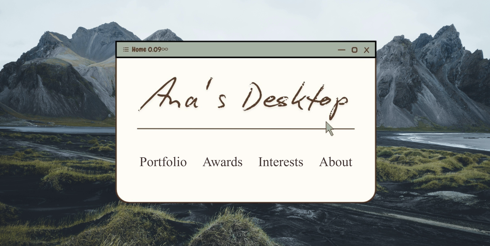

# Meet-Ana <3

Hey this is my portfolio website, the very first one. I created it to create a display of my projects, awards, interests and activities. The interests page include my song covers, and anime & drama favorites. The website is created using HTML, CSS and Javascript. 

# Coolest Feature
My About page includes a very cool backpack feature (inspired from Jana) which when clicked on displays items in my backpack and when the items are clicked, a description of the items pops up.

# Landing page
The home page is custom made on canva and it has a beautiful background in the back.

# Features
- Interactive backpack
- Hyperlinks to projects and websites
- Song convers of songs of different languages
- Styles boxes, header and footer
- Icons in the footer that link to my email, github and linkedin.

# Website Visual

## Music Covers Journal - October 20, 2025

# Total time: 5 hours (20% art time of the total project time)

# 11:00am - 1:00pm: 
I started recording with "Kal Ho Naa Ho" by Sonu Nigam. Since this song is a lengthy one it took some time to get familiarized with the notes and play it in a rhythm. So I recorded a few trial clips first to make sure everything is playing so=moothly and then recorded the final version.

2:00pm - 4:00pm
I then moved to the shorter and fun coverings like "Senorita" by Camila and Shawn Mendes, "Bella Ciao" by Manu Pilas, and "Gurenge" by Lisa (YES the Demon Slayer song!). The beats of these songs were catchy and repetitive so it was very fun and easy to play.

6:00pm - 7:00pm
During this last session I recorded the last song "Jeena Jeena" by Atif Aslam, this song has a very smooth rhythm. That is why I wished I could do strumming for this one. But I tried and it was just not happening for me so I stuck to playing the notes.

Throughout and before the session, I made some videos to practice before starting and also to track my progress on playing the song properly. The notes helped me a lot in being able to learn and record all these songs in such a short amount of time. 

Below I am attaching some of my practice recordings. To listen to the final versions, please go my website Meet-Ana. 

# Recordings